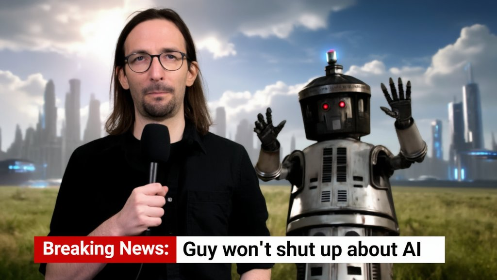

Researcher, Engineer, Tinkerer

## Private

In my off hours, I am…

- a tinkerer: I have been tinkering with Generative Artificial Intelligence before it was cool.
- a gamer: board games, video games, role-playing games, tabletop games; you name it!
           *Epic Spell Wars* is great, by the way.
- an archer: currently shooting with a 28 lbs recurve bow. Sometimes, I also hit the target.
- a cartograph: I sometimes spend some time to survey for OpenStreetMap.
                I am no stranger to geographic information systems.
- an additive manufacturing enthusiast: this is slang for "I know 3d printing, and I know some CAD".

## Business

For business stuff, you can probably just check my [LinkedIn] profile, I guess.

Currently, I am doing Senior Product Owner shenanigans at [Dynatrace].
Check us out, we are great!
Stuff on my plate includes (or included):

- Site Reliability Guardian
- ServiceNow connector
- PagerDuty connector
- GitLab connector
- Jenkins connector
- Red Hat: Event-Driven Ansible connector
- Backstage Plug-in
- Local MCP Server
- and other things yet to come 😉

## Language Skills

- German (native, allegedly)
- English (fluent)
- ~~Latin (ferrugineo)~~
- ~~Ancient Greek (πολύ σκουριασμένο)~~

## Find me

In alphabetical order, you can find me here:

- [GitHub] – even if it's puny… right now
- [LinkedIn]
- [OpenStreetMap]
- [ResearchGate] – thinking about closing it eventually. I am no longer active in that community.

Hit me up if you want to talk about things!

[GitHub]: https://github.com/MrManny
[LinkedIn]: https://www.linkedin.com/in/manuel-w-a54850235/
[OpenStreetMap]: https://www.openstreetmap.org/user/MrManny
[ResearchGate]: https://www.researchgate.net/profile/Manuel-Warum
[Dynatrace]: https://www.dynatrace.com/
