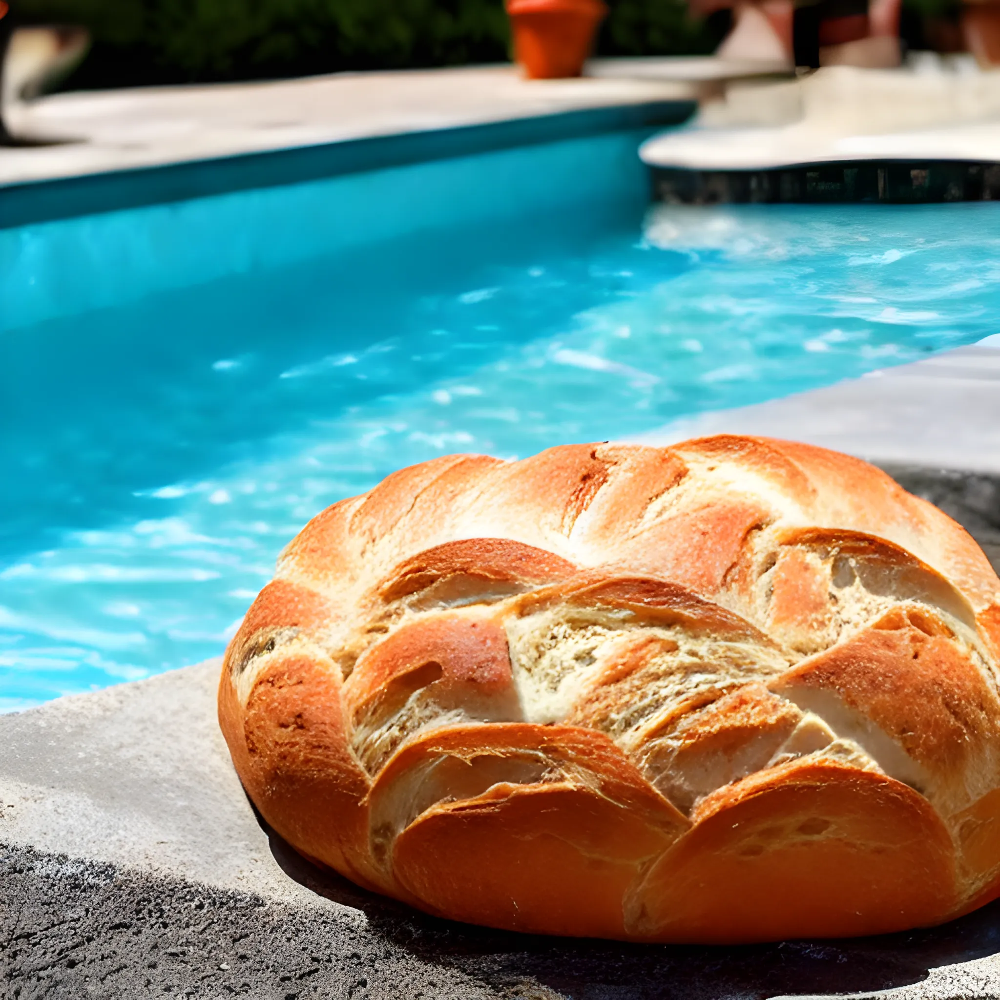
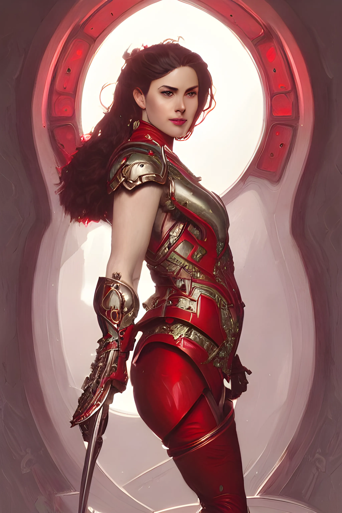
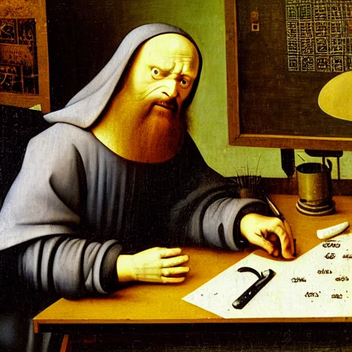
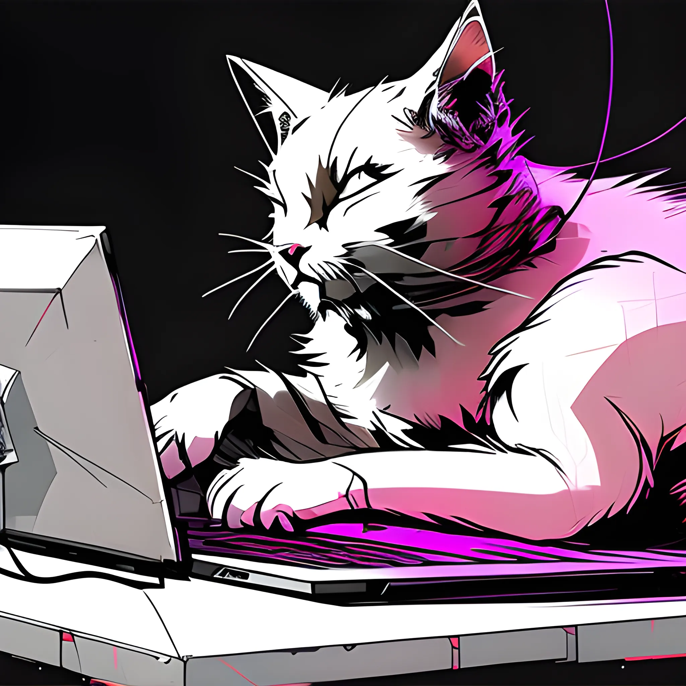
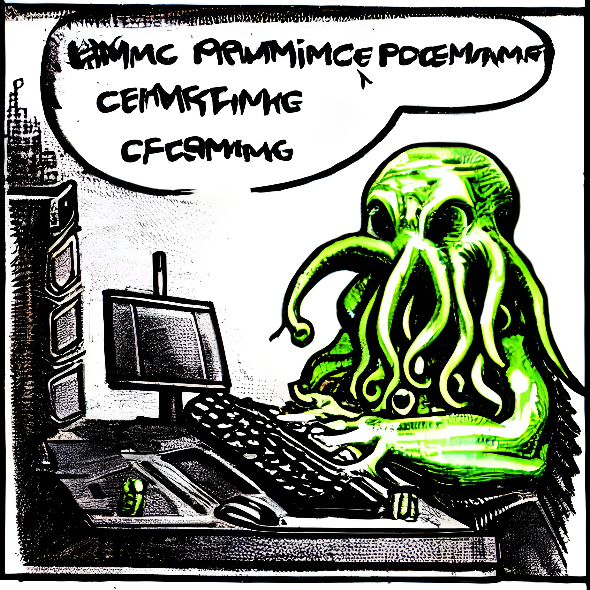
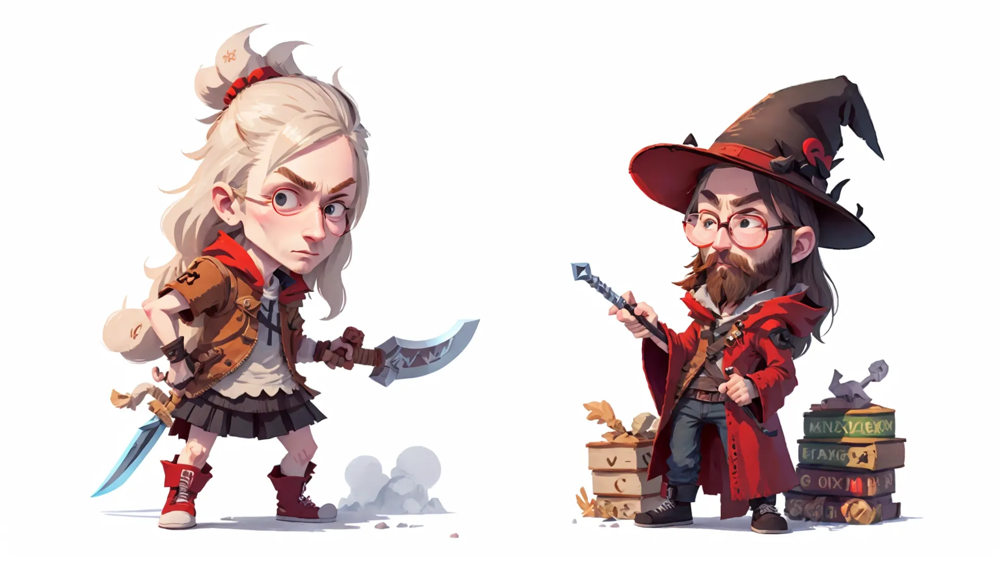

Here's a list of images generated with Stable Diffusion.
At least those images that survived my hard drive for more than two days, i.e., I was not *immediately*
dissatisfied.

# Stable Diffusion 1.5 (or derivatives)

## Breadpool

It's a pool. There is bread.
Any similarities to preexisting fictional characters are coincidental. For realsies.
Especially Deadpool. I mean, who'd look at this image and say, "yep, that's a Deadpool pun"?

## Captain Austria

Did I mention coincidental similarities and plays on words yet?
As usual, any similarities are coincidental, etc.
So anyway, here's what Captain Austria might look like:

## Cool Doggo

If only you could sniff in cyberspace.

## Management Reactions

Sometimes I take my requests to management.
Here's an artist's rendition of what their initial reaction might look like when I
tell them my latest and greatest idea.

## Meow

It's just a cat. Don't worry, it can't hurt you... I think.

## PO Life

Have you ever wondered what the Product Owner experience might feel like?
Wonder no more.

## RPG

I have tons of D&D character portraits and such.
But for this occasion, I may have also included my wife and made a whimsical desktop background.

